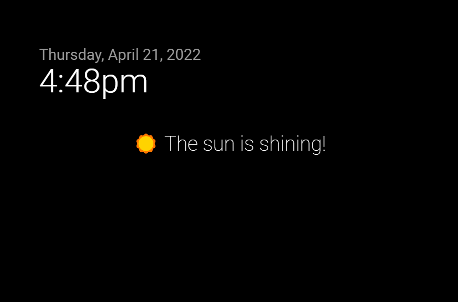

# MMM-MQTTAlert
 
A module for [MagicMirror²](https://github.com/MichMich/MagicMirror) to show payload from subscribed MQTT messages.



## Install

1. Clone repository into the `MagicMirror/modules/` folder:

```
cd ~/MagicMirror/modules
git clone https://github.com/Lavve/MMM-MQTTAlert
```

2. Add the module to the MagicMirror config.js:

```js
{
  module: 'MMM-MQTTAlert',
  position: 'middle_center',
  config: {
    removeMessage: 'EMPTY',
    fontSize: '2rem',
    topics: [''],
    mqttServer: {
      address: '',
      user: '',
      password: '',
    },
  },
},
```

## Configuration options

| Configuration | Default | Type | Optional | Description |
| --- | --- | --- | --- | --- |
| removeMessage | `'EMPTY'` | str | ✓ | String sent to remove the message |
| fontSize | `'2rem'` | str |  ✓ | Text size of the message. If unit is left out, `'px'` will be used |
| topics | `[]` | array |   | Array of topics the module should listen to |
| mqttServer | `{}` | obj |   | See below |

### mqttServer options

| Configuration | Default | Type | Optional | Description |
| --- | --- | --- | --- | --- |
| address | `''` | str |  | URL or IP of MQTT broker |
| user | `''` | str | ✓ | Username for the MQTT broker |
| password | `''` | str | ✓ | Password for the MQTT broker |

## The message

To show a message the mqtt message must contain a unique id, followed by a pipe ('`|`'), and then the message it self, like so:

```
MySunnyId|☀️ The sun is shining!
```

To remove a message the mqtt message must contain the specific id, followed by a pipe ('`|`'), and then the remove message set in the config (`'EMPTY'` is default):

```
MySunnyId|EMPTY
```

## Collaborate

Pull requests, translations and suggestions for improvements are more than welcome.

## Donations

[🍻 Buy me a beer](https://www.paypal.com/cgi-bin/webscr?cmd=_donations&business=SM9XRXUPPJM84&item_name=%40lavve+MagicMiror+Modules) if you like my modules! ❤️
